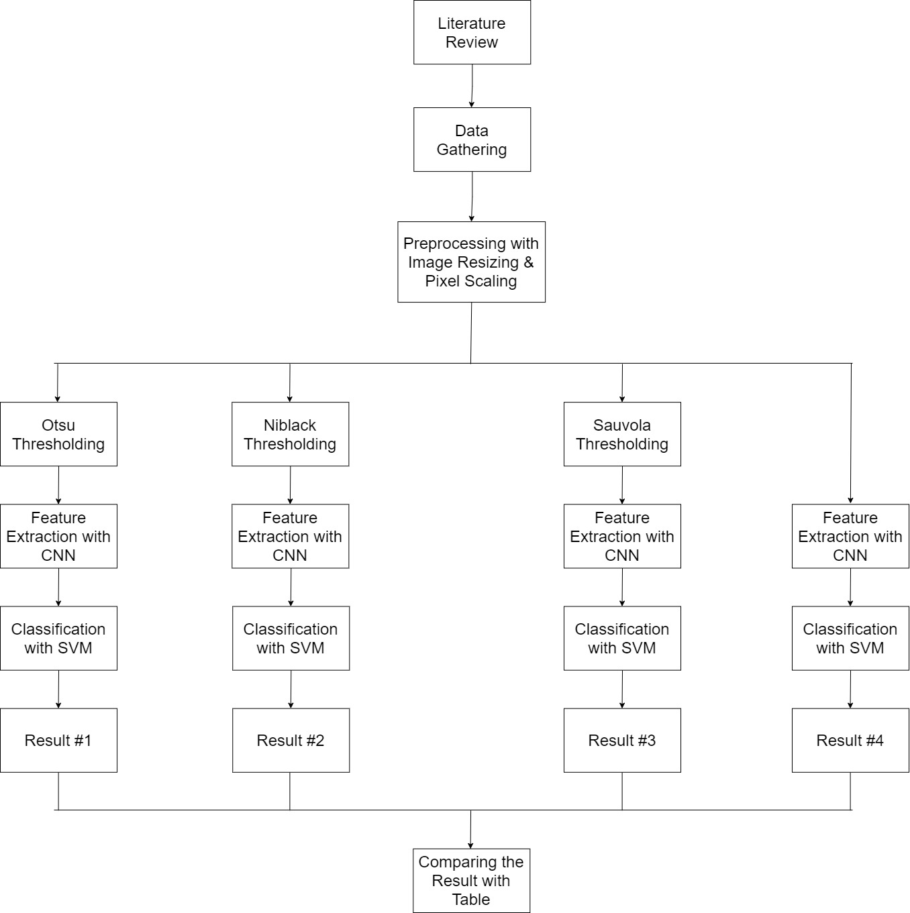

# Source Code Skripsi Brain Tumor Segmentation 

Menggunakan referensi template docs milik [eugeneyan](https://github.com/eugeneyan/ml-design-docs)

Paper: Coming soon...

---

## 1. Overview

Metode segmentasi adalah proses yang bisa melakukan ekstraksi pada objek yang diinginkan, selain itu metode segmentasi juga digunakan untuk mengisolasi objek yang diinginkan dari sebuah gambar untuk melakukan analisis pada objek. Nantinya akan dilakukan empat skenario yang dimana masing - masing skenario akan dilakukan implementasi segmentasi *image thresholding* yang berbeda - beda. Dataset yang akan digunakan adalah gambar MRI Tumor Otak.

## 2. Tujuan

Melakukan klasifikasi tumor otak untuk mendapatkan performa yang lebih baik dari penelitian sebelumya dengan melakukan pendekatan yang berbeda.

## 3. Requirements & Constraints

Mengukur performa metode segmentasi Otsu, Niblack, dan Sauvola *thresholding* dalam membantu Support Vector Machine (SVM) dalam melakukan klasifikasi gambar tumor otak.

## 4. Methodology

### 4.1 Problem statement

Penelitian yang dilakukan oleh Sruti et al. [[1]](https://www.indianjournals.com/ijor.aspx?target=ijor:jicse&volume=8&issue=2&article=002) terdapat kelemahan, yaitu tidak diimplementasikan metode segmentasi. Alasan menggunakan metode segmentasi adalah proses segmentasi bisa melakukan ekstraksi pada objek yang kita inginkan.

### 4.2 Data

[Brain MRI Images for Brain Tumor Detection by Navoneel Chakrabarty](https://www.kaggle.com/navoneel/brain-mri-images-for-brain-tumor-detection)

### 4.3 Techniques

Menggunakan Convolutional Neural Network (CNN) untuk proses feature extraction dan SVM untuk melakukan proses klasifikasi.

### 4.4 Metrics Evaluation

- Accuracy

$$
Accuracy = \frac{TP+TN}{TP+TN+FP+FN}
$$

- Recall

$$
Recall = \frac{TP}{TP+FN}
$$

- Precision

$$
Precision = \frac{TP}{TP+FP}
$$

- F1-score

$$
F1-score = \frac{2*(Precision*Recall)}{(Precision*Recall)}
$$

### 4.5 Scenario

- Skenario Pertama akan menggunakan metode segmentasi Otsu thresholding dalam membantu performa klasifikasi tumor otak menggunakan metode SVM.
- Skenario Kedua akan menggunakan metode segmentasi Niblack thresholding dalam membantu performa klasifikasi tumor otak menggunakan metode SVM.
- Skenario Ketiga akan menggunakan metode segmentasi Sauvola thresholding dalam membantu performa klasifikasi tumor otak menggunakan metode SVM.
- Skenario Keempat tidak menggunakan metode segmentasi apapun dan akan melakukan klasifikasi tumor otak menggunakan metode SVM.

## 5. Implementation

### 5.1 Rancangan Penelitian

## 6. Appendix

### 6.1 Experiment Results

| Skenario Pengujian                    | Validation Accuracy | Training Accuracy | C   | Precision | Recall | F1-Score |
|---------------------------------------|---------------------|-------------------|-----|-----------|--------|----------|
| Skenario 1 (Otsu Thresholding)        |        0.7843       |       0.8019      | 0.1 |    0.8    |  0.74  |  0.8405  |
| Skenario 2 (Niblack Thresholding)     |        0.8431       |       0.9653      |  1  |    0.84   |  0.83  |   0.875  |
| Skenario 3 (Sauvola Thresholding)     |        0.8235       |       0.9504      | 0.1 |    0.84   |  0.79  |  0.8656  |
| Skenario 4 (Tanpa Image Thresholding) |        0.7647       |       0.8068      | 0.1 |    0.79   |  0.72  |  0.8285  |

### 6.2 References

[[1] A Hybrid Approach to Brain Tumor Detection from MRI Images Using Computer Vision](https://www.indianjournals.com/ijor.aspx?target=ijor:jicse&volume=8&issue=2&article=002)

## TODO List

- [x] ~~Replikasi model dan codingan dari paper utama~~
- [x] ~~Membuat function untuk Otsu, Niblack dan Sauvola thresholding~~
- [x] ~~Apply image function ke test.jpg~~
- [x] ~~Mengambil nama file dalam bentuk list~~
- [x] ~~Apply image function ke test.jpg dan save ke bentuk baru~~
- [x] ~~Apply image function ke list file~~
- [x] ~~Train new image dengan model dari paper utama~~
